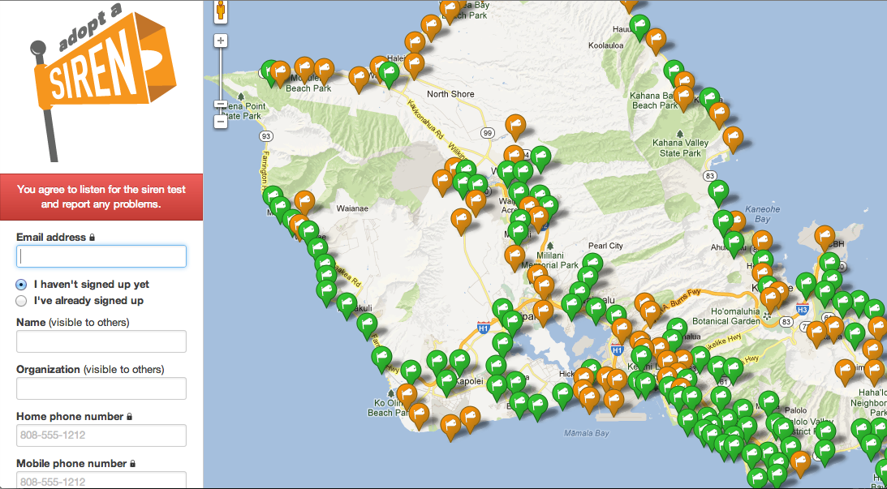
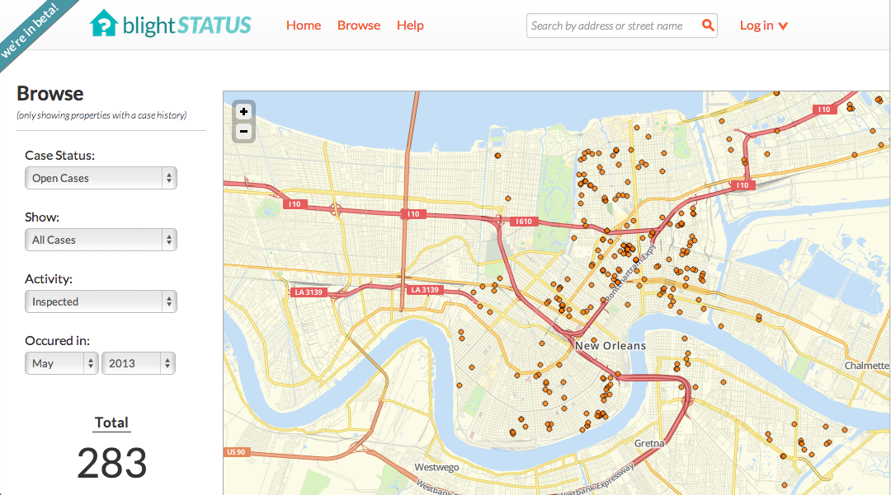
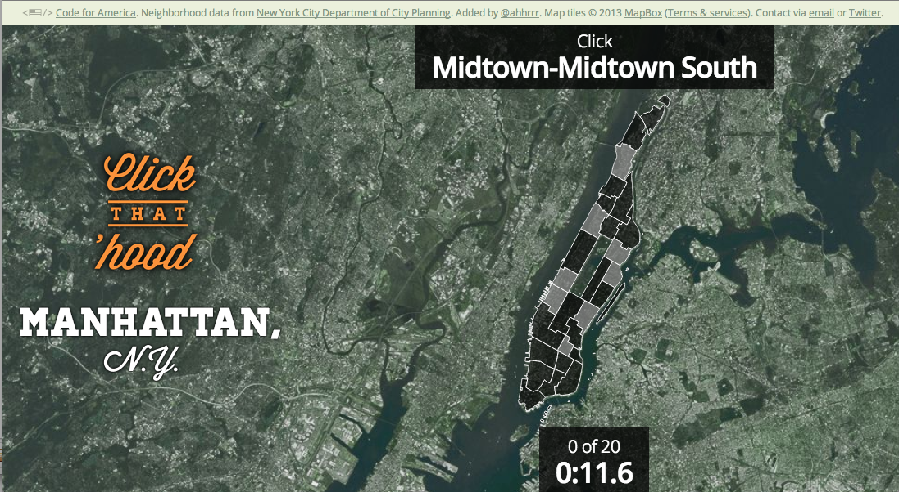
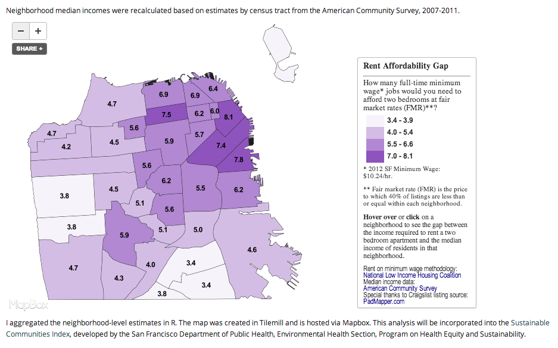
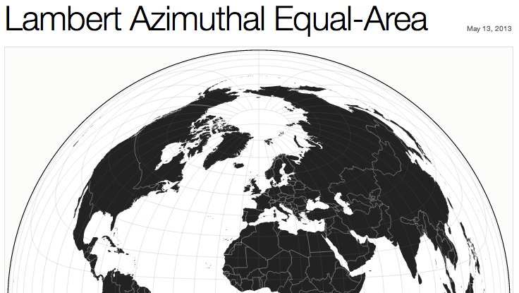

# The New Users

Sophia Parafina  
Code For America  
2013 Fellow  
FOSS4G-NA 2013  

## Background

Code for America is a non-profit with the mission to build a network of cities, citizens, community groups, and startups committed to re-imagining government for the 21st century. Code for America's major programs are the Fellowship, the Accelerator, the Brigade, and the Peer Network. The Fellowship was the first of Code's programs and it recruits developers, designers, and entrepreneurs to work with cities to develop solutions and apply technologies to make a difference. The Fellowship can be summarized as showing what is possible. The Accelerator program builds up civic startups by providing them with funding, business training and advice, and by providing them with a national platform for pitching their products and ideas. The Peer Network connects public servants with other forward thinking peers and business leaders. It encourages the exchange of ideas, solutions, best practices and even software code. The Brigade program encourages and provides a framework for local civil engagement. Civic technologists have a national network for remixing and reusing applications to promote openness in cities. Brigades are local chapters with the national reach back capabilities.

## What Do We Make?

Code for America makes applications for government. These applications range from simple applications such as [adopta-a-hydrant](https://github.com/codeforamerica/adopt-a-hydrant) that allows citizens to "adopt" civic infrastructure, such as fire hydrants or tsunami siren to [BlightStatus](https://github.com/codeforamerica/blightstatus) which helps cities and citizens manage information about properties in their neighborhood. Applications at Code for America are developed with an eye towards re-usability. For example, the adopt-a-hydrant has been successfully reimplemented as [Adopt-A-Siren](http://sirens.honolulu.gov/); an application where citizens report on the status of tsunami sirens in Hawaii.

 __Adopt-A-Siren implemented in Hawaii__

Location is an important part of many projects. Maps are typically the first type of visualization used in civic applications. However, it's important to note that location is just one of many data types used in a civic application This means that the map is not always the central focus for the application, but an interface to other data. Maps are means to organize information in a way that is meaningful and intuitive to users.

 __BlightStatus in New Orleans__

In addition to applications that address specific civic needs, Code for America also builds geospatial games such as [Click-that-Hood](http://click-that-hood.com/) which tests the player's knowledge of neighborhoods across the globe. Users are also invited to [add neighborhoods](https://github.com/codeforamerica/click_that_hood/wiki/How-to-add-a-city-to-Click-That-%E2%80%99Hood	) from a city of their choice to the game

 __Click-that-Hood on Manhattan__

### How Geospatial Gets Used

The Code for America code base in [github](http://github.com/codeforamerica) currently list 309 repositories. Searching through the repositories using geospatial related keywords shows that maps and spatial data are included in many applications.

	keyword      frequency in code 

	map          5881  
 	address      3616  
 	zipcode      150  
 	street       910  
 	state        6314  
 	lat          1752  
 	lng          346  
 	lon          1374  
 	long         2533  
 	coordinate   409  
 	geojson      836  
 	kml          890  

As expected, many projects use a map as display for information about assets, locations and people. [Deepdish](http://github.com/codeforamerica/deepdish) is an application for viewing and searching Chicago's health inspections on a map. [MapMacon](https://github.com/codeforamerica/map_macon) is a simple site to show custom maps of Macon, Georgia.

However, geospatial data also is used in a variety of ways that do not involve a map. The [broadband map ruby](https://github.com/codeforamerica/broadband_map_ruby) project is a Ruby wrapper for the FCC Broadband Map API.

	# Provide all the wireless providers within a US census block given a passed latitude and longitude.
	BroadbandMap.wireless(:data_version => 'fall2010', :latitude => '38.0', :longitude => '-77.5')

	# Provide all the wireline providers within a US census block given a passed latitude and longitude.
	BroadbandMap.wireline(:data_version => 'fall2010', :latitude => '38.0', :longitude => '-77.5')

	# Returns rankings within nation by specific geo id
	ßßBroadbandMap.almanac_ranking_geo_id_within_nation({:data_version => 'fall2010', :census_metric_type => 'population', :ranking_metric => 'wirelineproviderequals0', :geography_type => 'county', :geography_id => '01101', :sort_order => 'asc'})

Another service oriented project is [amiinlv](https://github.com/codeforamerica/amiinlv) which is a simple service that determines if a location is withing the Las Vegas city limits. In a rapidly growing city such as Las Vegas, it can be difficult to tell if a place is inside the city boundaries and if a citizen can access city services at that location. 

Code for America is deeply vested in promoting the idea of open data, which seeks to make data available to the public without restrictions. [Geodata-checkout](https://github.com/codeforamerica/geodata-checkout) is a different take on a geodata portal. Instead of the typical search-for-data-by-map and display-download-links pattern of geospatial portal, [geodata-checkout](http://historicchicago.herokuapp.com/#) lets the user draw a polygon around the area of interest and the data is available as KML or GeoJSON. In addition to downloads, the application can also display the data as an [animated time line](http://historicchicago.herokuapp.com/timeline?customgeo=51980be1269cdb0200000002) of the features in the selected area.

 __Animated time line in Geodata Checkout__

Code for America projects address a wide range of civic challenges, with many of them containing a geospatial component. Applications have focused on display and search, providing geospatial data via services, and even cataloging and geoportal-like sites.

## Technology Choices

### Languages

Github statistics show that Javascript is the predominant language used in applications, which is not surprising because many of the applications are deployed as either a website or embedded into a website. Ruby is the second most popular language over Python which hash rapidly become the scripting language for manipulating geospatial data. This suggests that the focus is more on making use of geospatial services rather than manipulation of geospatial data. There is a distinct focus on user centered applications versus applications that perform geospatial functions.

	Javascript			102
	Ruby 				66
	Python				34
	PHP					34
	Objective-C			4
	Java 				2
	ActionScript 		1
	CoffeeScript		1

### Frameworks

Code for America applications use a variety of frameworks. Earlier applications make use of PHP and Drupal and some projects of Django and Python. More recently Ruby-On-Rails and node.js have become popular frameworks for authoring applications. This tends to reflect the rapid prototyping environment at Code for America where Fellows have less than a year to develop and deploy applications in their respective cities. Again, geospatial specific frameworks such as geodjango are not used.

### Services

The primary departure of applications with a geospatial component is the lack of interest and will to deploy a full geospatial stack. Even tightly integrated stacks built for ease of deployment are over looked for services that provide highly customizable map tiles with thin javascript clients such as leaflet.js. In some ways, this represents the triumph of design over technology because of the recognition that applications with a map component are better received if they focus on a dedicated task rather than being a general purpose map client. Interest in web mapping interoperability has waned; because ff data is to be shared, it's done by at the level of an Application Programming Interface (API) that returns the data in lightweight geospatial formats such as GeoJSON or KML. 

The clear winners in this shift are companies providing geospatial services in the form of customizable map tiles (currently raster tiles, but soon to include vector tile) and on line spatial functionality. Both [MapBox](http://mapbox.com) and [CartoDB](http://cartodb.com) fall into these categories. Google Maps inadvertently started the trend for using a mapping service and API. For many applications, Google Maps is the first stop in prototyping because of it's mature API and attendant services such as geocoding and transportation routing. However, licensing may prove to be an incentive to move to platforms with less restrictive licensing. Developers pick and choose the services from the Google Maps API, eschewing the maps and using just the geocoding and routing functions. It's important to note that CartoDB also offers geocoding as service and given their PostgreSQL/PostGIS backend, they could possibly offer routing services in the future.

So what makes these applications different from mashups that overlay data on a map? First, these are applications that address a specific problem, it has a geospatial component, but the map is not the focus. Second, these civic applications are not intended to be one-off efforts, rather they are designed to be incorporated into the information technology architecture of a government body. Finally, design plays a larger part in these applications; developers are no longer satisfied to use default tiles and are requiring more customization in terms of map styles and design elements.

## Data Driven

One of the unexpected successes is the pairing of open source software with open data into a functioning business model. Like the US Census TIGER files before it, OpenStreet Map data is spurring business innovation but at a global scale. Custom OSM map tiles have become the defacto map layer for many high profile businesses such as FourSquare and Apple. Because services providing custom map tiles largely solve the problem of a basemap, developers and designers can focus on the application and the civic data. This has freed developers to use libraries and analytical tools outside the normal canon of both commercial and open source tool sets. 

Visualization libraries such as [d3.js](http://d3js.org/) and statistical analysis packages such as [R](http://www.r-project.org/) are becoming part of the standard tool set for on line mapping. In this [example](http://www.mizmay.com/), rental data is preprocessed in R and displayed using the Mapbox Service

 __Rent Affordability Gap Processed in R__

Another new development is the implementation of map projections within the browser using the d3.geo projections. Although the utility of map projections may not be evident for large scale or local data in web mapping, they can be quite evident at regional scales.

 __Lambert Equal Area Azimuthal__

It's important to note that these developments come from outside the traditional mapping industry and come from the disparate fields of data journalism and visualization. While the GIS industry continues to build yet another next generation Common Operation Picture application, geospatial applications have become commonplace and even expected method of communicating information.

## What's Next?

The trend towards single page applications with integrated services will continue for reasons of simplicity and ease of maintenance. This means an increase in geospatial services offerings such as:

*  gecoding solutions
*  multimodal routing (car, transit, bicycle, walking)
*  administrative  (e.g. what county, city, zipcode, census tract, voting district)
*  aerial imagery
*  satellite imagery
*  subsurface water and mineral rights
*  utility right of ways
*  weather

The list could go on, but geocoding and routing are the services needed most. This particular design pattern for geospatial applications will continue to erode the need for deploying geospatial stacks and geoportal applications. 		

